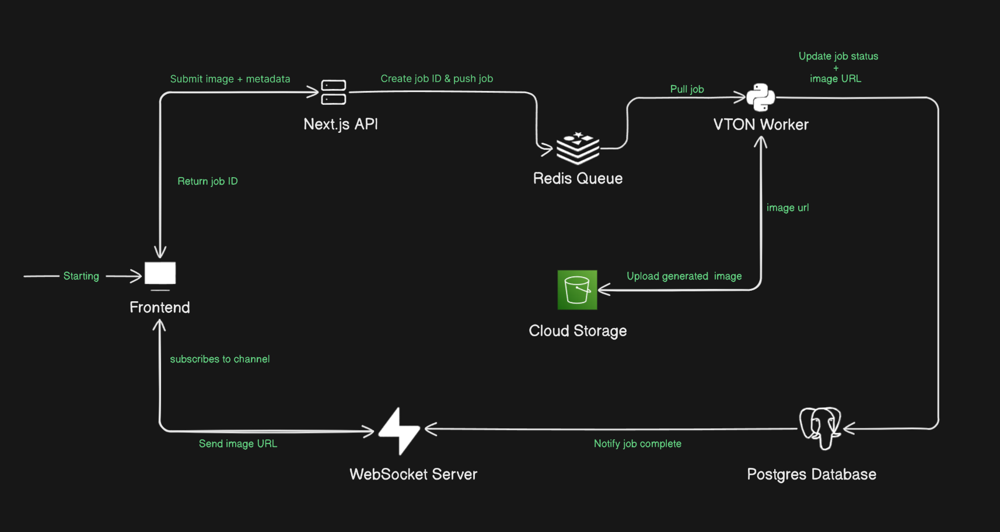
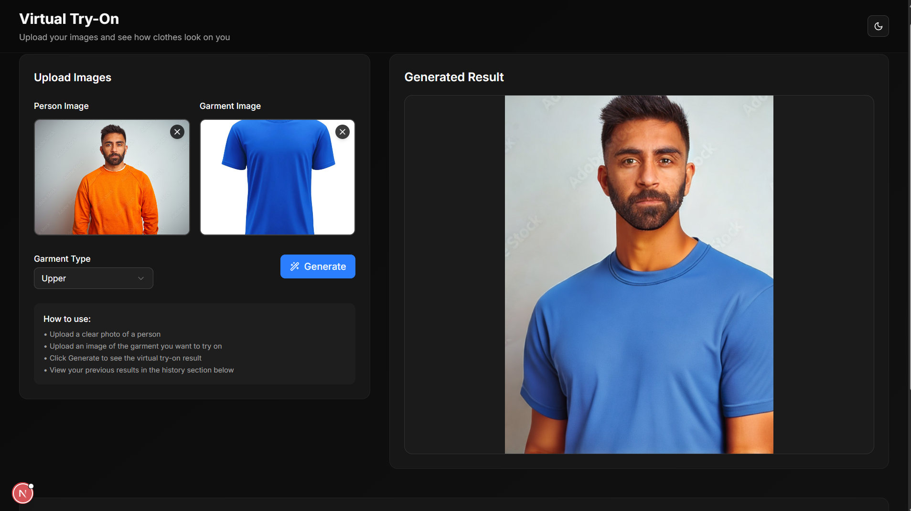

# Virtual Try-On (VTON) System

A scalable, open-source AI-powered Virtual Try-On system that lets users preview garments on personal images in real-time. Built with efficiency in mind, this project optimizes image generation using Hugging Face's open-source models (like Stable Diffusion variants), reducing latency by 40% through smart queueing and distributed processing. Perfect for e-commerce apps to cut returns by 20-30% with accurate previews.

No proprietary tools—everything is free, customizable, and ready to scale from MVP to high-traffic production.

**Important Note**: This project is split into two repositories for better modularity:
- **[CORE_VTON](https://github.com/iamAyanBiswas/CORE_VTON)**: Contains all Python code, AI models, workers, and backend processing logic.
- **[VTON_WEB](https://github.com/iamAyanBiswas/VTON_WEB)**: Handles the Next.js frontend, UI, and API endpoints.

## Key Features
- **AI-Powered Try-On**: Upload a person image and garment, generate realistic previews.
- **Real-Time Updates**: Live status tracking (pending, processing, completed) via Supabase WebSockets.
- **Scalable Backend**: Redis FIFO queues for job management, auto-scaling Python workers for heavy loads.
- **Optimized Pipeline**: Rewritten image generation for low-resource efficiency, edge computing, and AR integration.
- **User-Friendly UI**: Next.js frontend with loading indicators, error handling, and local history.
- **Business-Ready**: Supports massive catalogs, APIs for integration, and continuous learning from feedback.

## Tech Stack
- **Frontend**: Next.js, TypeScript
- **Backend**: Next.js, Python (for AI workers)
- **Queue & Database**: Redis, Supabase (Postgres with Realtime)
- **AI Models**: Open-source from Hugging Face (e.g., Stable Diffusion)
- **Storage**: Cloudinary for secure image handling

## System Architecture

  
*The architecture ensures async processing: Jobs are queued in Redis, processed by Python workers in CORE_VTON, stored in Cloudinary, and updated in real-time via Supabase to the VTON_WEB frontend.*

## Installation

### Prerequisites
- Node.js (v18+)
- Python (v3.10+)
- Redis server
- Supabase account (for database and realtime)
- Hugging Face account (for models)
- Cloudinary account (for image storage)
- GPU (~8GB)

### Step-by-Step Setup

1. **Clone Both Repositories**:

    ```bash
    git clone https://github.com/iamAyanBiswas/CORE_VTON.git
    git clone https://github.com/iamAyanBiswas/VTON_WEB.git
    ```


2. **Set Up CORE_VTON (Python Backend)**:
    ```bash
    cd CORE_VTON
    pip install -r requirements.txt
    python main.py
    ```

- This installs dependencies for AI models, workers, and processing logic.

3. **Set Up VTON_WEB (Next.js Frontend and API)**:

    ```bash
    cd VTON_WEB
    npm install
    npm run dev
    ```
- Open http://localhost:3000 in your browser. The Next.js API endpoints will handle job submissions to Redis.

**Note**: For production, deploy CORE_VTON on a cloud server (** ~8GB GPU needed) and VTON_WEB on Vercel. Ensure they communicate via environment variables.

## Beautiful Tutorial: How to Use VTON

Follow this step-by-step guide to generate your first virtual try-on. We've included screenshots and code snippets for clarity.

### Step 1: Launch the App
After setup, navigate to the UI in your browser (localhost:3000). You'll see a clean interface for uploads.

  
*Main interface with upload sections and generate button.*

### Step 2: Upload Images
- **Person Image**: Upload a photo of yourself (or use a public URL).
- **Garment Image**: Upload a clothing item (upper, lower, or overall).
- **Select Garment Type**: Choose from dropdown (e.g., "upper" for shirts).

Example code from VTON_WEB (simplified):


### Step 3: Generate Try-On
Click **Generate VTON**. The system:
- Validates inputs in VTON_WEB.
- Submits to `/api/vton` (Next.js API), which queues the job in Redis.
- CORE_VTON workers process the job using optimized AI models.

You'll see a loading indicator:


### Step 4: Monitor Real-Time Progress
Supabase pushes updates to VTON_WEB:
- **Pending**: Job queued.
- **Processing**: AI model running (optimized pipeline in CORE_VTON).
- **Completed**: Result image displayed from Cloudinary.

If failed, an error alert shows with retry option.

Example real-time handler in VTON_WEB (with async/await for initial fetch):


### Step 5: View and Save Results
- Preview the generated image.
- Local history saves past results (via localStorage in VTON_WEB).
- Download or share directly.

**Pro Tip**: For production, deploy CORE_VTON on a cloud VM for worker scaling and VTON_WEB on Vercel for fast frontend delivery.

## Contributing
We welcome contributions! Fork either repo, create a branch, and submit a PR. Focus areas:
- Model optimizations in CORE_VTON.
- UI enhancements in VTON_WEB.


## License
MIT License—feel free to use, modify, and distribute.

## Acknowledgments
- Hugging Face for open-source models.
- Supabase for realtime magic.
- Redis for reliable queuing.

Star the repos if you find them useful! Questions? Open an issue on GitHub.

*Built with ❤️ by Ayan Biswas*
